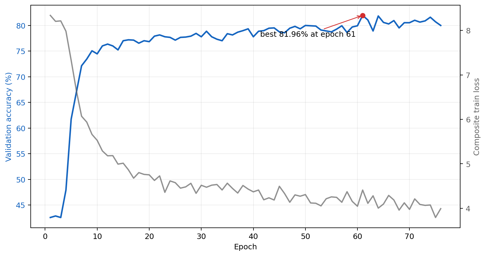
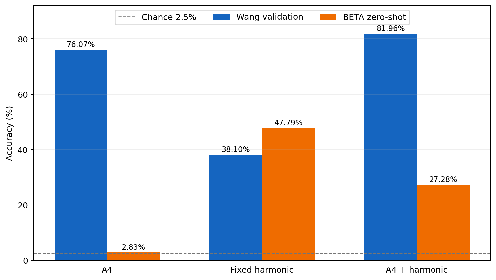
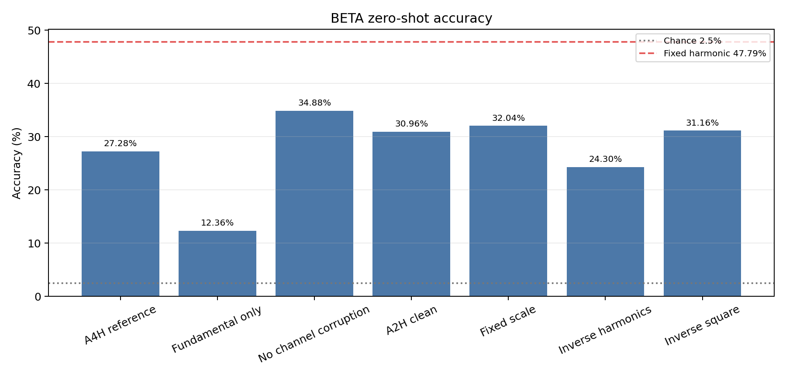
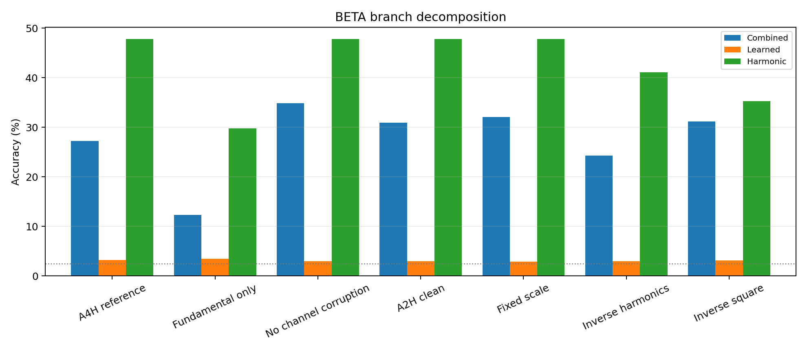
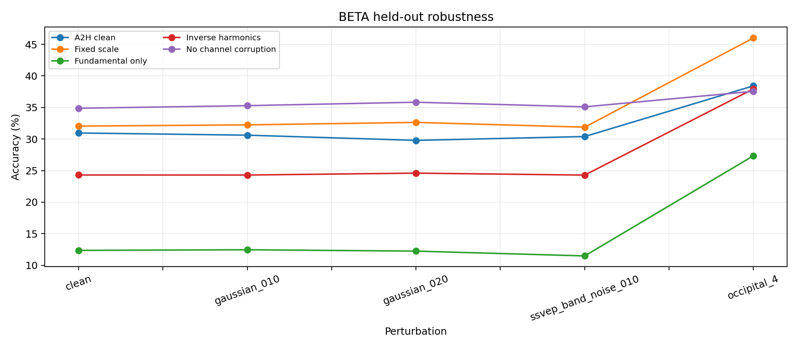
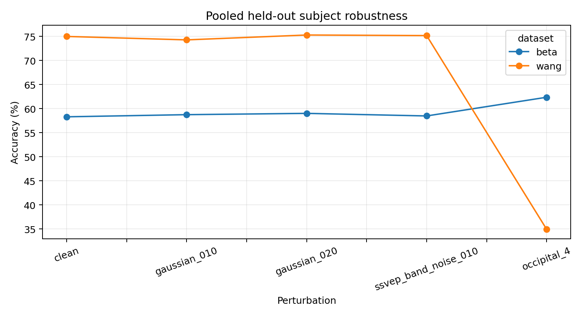
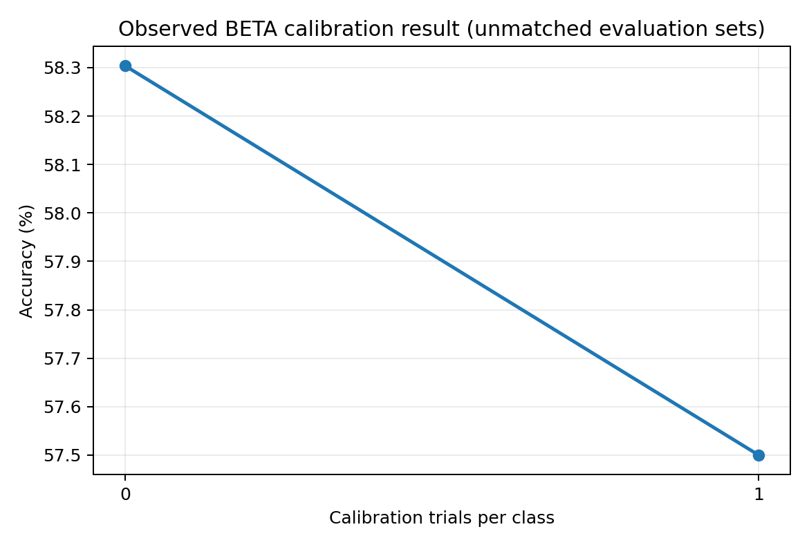

# A4 harmonic hybrid 후속 실험 보고서

작성일: 2026-09-03
최종 갱신: 2026-09-04
문서 상태: A4H 후속 ablation, pooled 확장, noise 및 calibration 평가 완료
선행 문서: [Calibration-Free EEG overnight REVE ablation 보고서](overnight_ablation_report_20260902.md)
W&B run: [20260903_w2b_A4_harmonic_uniform_s42](https://wandb.ai/jm020827/calibration-free-eeg/runs/bch86uil)

## 제출용 실험 보고서

### 1. 연구 및 실험 내용

선행 ablation에서 REVE 기반 A4는 Wang validation 76.07%까지 학습됐지만 BETA zero-shot은 2.83%로 chance 수준에 머물렀다. 반면 EEG를 후보 자극의 기본 주파수와 2차부터 5차 배수 주파수에 투영해 power를 비교하는 fixed harmonic 방식은 BETA 47.79%를 기록했다. 이번 실험은 학습된 표현과 명시적 SSVEP 규칙을 함께 쓰면 데이터셋 간 전이가 개선되는지 확인하기 위해 A4 logits에 harmonic logits을 더했다. Wang 27명 6,480 trial로 학습하고 Wang 7명 1,680 trial의 validation만으로 checkpoint를 선택했으며 BETA 70명 11,200 trial은 학습에 사용하지 않고 마지막에 한 번 평가했다. REVE backbone은 고정하고 condition prompt, adapter, latent module, classifier와 harmonic 결합 scale을 학습했다. Epoch 61에서 Wang validation 81.96%로 최고 성능을 얻었고 15 epoch 동안 개선되지 않아 epoch 76에서 종료됐다. BETA zero-shot accuracy는 27.28%로 기존 A4보다 24.45%p 상승했지만 fixed harmonic보다 20.51%p 낮았다. 따라서 harmonic prior는 REVE 경로의 전이를 보완했으나 단순 logit 결합만으로는 harmonic baseline의 성능을 유지하지 못했다.

### 2. 반성 및 평가

이번 실험은 train loss가 감소하고 Wang 성능이 높아져도 BETA 성능이 함께 보장되지 않는다는 점을 다시 확인했다. 명시적 주파수 규칙을 결합해 chance 수준은 벗어났지만 목표 Floor 30%에도 2.72%p 부족하므로 성공으로 단정할 수 없다. 또한 seed 42 한 번만 실행했고 Wang과 BETA는 정제된 실험실 데이터이므로 잡음이나 calibration 감소 효과를 직접 검증하지 못했다. 후속 실험에서는 branch별 출력을 분리 평가하고, Wang과 BETA를 피험자 단위로 혼합 학습한 뒤 잡음 강도와 calibration trial 수에 따른 성능 변화를 측정해야 한다.

## 1. 초록

선행 실험에서 A4는 Wang validation 76.07%로 가장 높은 source 성능을 보였지만 BETA zero-shot accuracy는 2.83%로 chance 2.5%와 거의 같았다. 반대로 학습 모델을 사용하지 않고 SSVEP의 기본 주파수와 배수 주파수 파워를 직접 비교한 fixed harmonic baseline은 BETA 47.79%를 기록했다. 이번 실험은 이 간극을 바탕으로 A4에 phase-invariant harmonic 분기를 결합했다. Wang validation으로 선택한 epoch 61 checkpoint는 81.96%를 기록했고 BETA zero-shot accuracy는 27.28%였다. 기존 A4보다 source는 5.89%p, target은 24.45%p 상승했으나 fixed harmonic보다 target이 20.51%p 낮았다. 명시적 주파수 규칙의 결합은 A4의 무작위 수준 전이를 완화했지만, learned branch와 단순 logit 합산이 fixed harmonic의 전이 성능을 유지하지는 못했다. 이번 결과는 seed 42 단일 실행이며 잡음과 calibration 양을 직접 변화시킨 실험은 아니다.

## 2. 선행 실험에서 이어지는 질문

선행 보고서의 직접적인 관찰은 다음과 같다.

| 구성 | Wang source validation | BETA zero-shot | 해석 범위 |
|---|---:|---:|---|
| A4 | 76.07% | 2.83% | source 분류는 가능했지만 dataset 간 전이는 확인되지 않음 |
| Fixed harmonic uniform | 38.10% | 47.79% | 명시적 주파수 규칙은 target에서도 작동했으나 learned A4와는 별도 방식 |
| A2 spectral uniform hybrid | 73.99% | 최종 미측정 | 중간 run이 cutoff되어 hybrid의 최종 target 수치가 없음 |
| A4 harmonic hybrid | 81.96% | 27.28% | A4보다 전이는 개선됐지만 fixed harmonic보다 낮음 |

이번 실험의 주제는 단순히 epoch를 늘리는 것이 아니다. A4를 유지한 상태에서 harmonic 분기 하나를 추가해 이전 A4와 비교하는 구조적 ablation이다. 비교 질문은 세 가지다.

첫째, harmonic 분기가 A4의 BETA zero-shot 실패를 완화하는가.

둘째, harmonic 분기를 추가해도 A4의 높은 Wang validation 성능이 유지되는가.

셋째, Wang에서 학습된 결합 비율이 BETA에서도 유효한가.

## 3. 모델 변경

~~~mermaid
flowchart LR
    X["EEG trial 64 channels × 400 samples"] --> R["Frozen REVE 62 positioned channels"]
    M["Acquisition condition"] --> C["Condition prompt"]
    C --> R
    R --> A["Conditioned adapter"]
    A --> L["Latent nuisance module"]
    L --> N["Learned logits 40 classes"]

    X --> O["Occipital 8 channels"]
    O --> F["Sin and cos projection 8.0 to 15.8 Hz"]
    F --> H["Fundamental plus 2nd to 5th harmonics"]
    H --> S["Standardized spectral logits"]

    N --> SUM["Logit sum"]
    S --> W["Positive trainable scale"]
    W --> SUM
    SUM --> Y["Predicted stimulus class"]
~~~

REVE 분기는 EEG의 시간적, 공간적 패턴을 표현으로 변환한다. REVE backbone 자체는 고정하고 condition prompt, adapter, latent module, classification head를 학습한다.

Harmonic 분기는 뒤통수 8채널의 원신호를 각 후보 주파수의 sine과 cosine에 투영한다. 후보는 8.0 Hz부터 15.8 Hz까지 0.2 Hz 간격의 40개 class다. 각 후보에 대해 기본 주파수와 2배, 3배, 4배, 5배 주파수의 power를 동일한 가중치로 합한다. sine과 cosine power를 함께 사용하므로 파형의 시작 위상에 덜 민감하다. 계산된 40개 점수는 trial 안에서 표준화한 뒤 양수로 제한된 학습 가능 scale을 곱해 A4 logits에 더한다.

이 구성에서 주파수 후보와 harmonic 관계는 학습으로 새로 발견하는 값이 아니라 미리 제공한 SSVEP 규칙이다. 학습되는 것은 이 규칙을 A4의 예측에 얼마나 강하게 반영할지다.

## 4. 데이터와 평가 절차

| 단계 | 데이터 | 피험자 수 | trial 수 | 사용 목적 |
|---|---|---:|---:|---|
| Train | Wang | 27 | 6,480 | parameter 업데이트 |
| Source validation | Wang | 7 | 1,680 | early stopping과 best checkpoint 선택 |
| Target test | BETA | 70 | 11,200 | 선택 완료 후 zero-shot 평가 |

한 trial은 200 Hz로 측정한 2초 EEG이므로 채널마다 400개 sample을 가진다. REVE는 위치 정보가 없는 CB1과 CB2를 제외한 62채널을 사용한다. Harmonic 분기는 뒤통수 영역 8채널을 사용한다. BETA label과 metric은 학습, hyperparameter 조정, checkpoint 선택에 사용하지 않는다.

최종 평가는 accuracy, balanced accuracy, macro F1, NLL, ECE, ITR을 기록한다. 40-class chance accuracy는 2.5%다. 선행 feasibility 문서의 BETA balanced accuracy 기준인 Floor 30%, Target 45%, Stretch 60%도 함께 표시하되 한 seed의 통과만으로 일반화 성공을 주장하지 않는다.

## 5. 학습 설정

| 항목 | 설정 |
|---|---|
| Seed | 42 |
| Epoch | 최대 100 |
| Early stopping | Wang validation 15 epoch 무개선 시 종료 |
| Batch size | 64 |
| Optimizer 설정 | learning rate 0.0003, weight decay 0.01 |
| Precision | AMP |
| Gradient clipping | norm 1.0 |
| Backbone | brain-bzh/reve-base, frozen |
| Harmonic | 1차부터 5차까지 uniform weighting |
| Harmonic scale | 초기값 1.0, 학습 가능 |

각 EEG에서 서로 다른 두 augmentation view를 만든다. 적용 항목은 뒤통수 8채널, 4채널, 2채널 subset 선택, channel dropout, 작은 Gaussian noise, 최대 8 sample의 시간 이동이다. 두 view에는 각각 supervised cross entropy를 적용하고 representation consistency와 symmetric logit consistency를 추가한다. Latent module에는 KL regularization을 적용하며 latent를 0으로 둔 예측에도 보조 cross entropy를 적용한다.

| 손실 항목 | 가중치 | 목적 |
|---|---:|---|
| 두 view의 supervised cross entropy | 1.0 | Wang label 분류 |
| Zero-latent auxiliary cross entropy | 0.5 | latent 없이도 class 정보를 유지 |
| Representation consistency | 0.1 | augmentation 전후 표현 안정화 |
| Logit consistency | 0.05 | augmentation 전후 예측 분포 안정화 |
| Latent KL | 0.001 | latent 분포 regularization |

## 6. 비교 및 판정 방법

가장 중요한 비교는 같은 seed의 기존 A4와 이번 A4 harmonic hybrid다. 두 구성의 차이는 harmonic 분기의 추가다. 따라서 source와 target 변화는 다음 순서로 해석한다.

| 관측 결과 | 제한된 해석 |
|---|---|
| Wang 유지, BETA 상승 | harmonic 정보가 source 성능을 해치지 않으면서 transfer에 기여했을 가능성 |
| Wang 상승, BETA 정체 | harmonic 분기까지 Wang 특성에 맞춰졌을 가능성 |
| Wang 하락, BETA 상승 | source 적합도와 frequency 기반 transfer 사이의 tradeoff 가능성 |
| Wang과 BETA 모두 하락 | A4 augmentation 또는 logit 결합 방식과 harmonic 분기의 충돌 가능성 |

Fixed harmonic 47.79%는 이번 모델이 반드시 넘어야 하는 확정 기준으로 사용하지 않는다. Fixed baseline과 hybrid는 학습 방식과 checkpoint 선택 과정이 다르기 때문이다. 다만 hybrid가 복잡도를 추가하는 만큼 fixed baseline보다 낮다면 learned branch가 실제로 제공한 이득이 있는지 별도 분석이 필요하다.

## 7. 결과

학습은 epoch 76에서 early stopping으로 정상 종료됐다. Wang validation으로 선택된 best checkpoint는 epoch 61이다.

| 모델 | Best epoch | Wang validation Acc | BETA Acc | BETA BA | Macro F1 | NLL | ECE | ITR |
|---|---:|---:|---:|---:|---:|---:|---:|---:|
| A4 reference | 32 | 76.07% | 2.83% | 2.83% | 2.05% | 4.709 | 24.84% | 0.01 |
| Fixed harmonic uniform | 해당 없음 | 38.10% | 47.79% | 47.79% | 48.89% | 2.135 | 8.79% | 46.92 |
| A4 harmonic hybrid | 61 | **81.96%** | **27.28%** | **27.28%** | **26.71%** | **3.084** | **12.67%** | **18.98** |

| 비교 | 변화 |
|---|---:|
| A4 harmonic hybrid의 Wang validation 대 A4 | +5.89%p |
| A4 harmonic hybrid의 BETA zero-shot 대 A4 | +24.45%p |
| A4 harmonic hybrid의 BETA zero-shot 대 fixed harmonic | -20.51%p |
| 사전 정의 Floor 30%까지 남은 차이 | -2.72%p |
| 사전 정의 Target 45%까지 남은 차이 | -17.72%p |

Epoch 61의 train loss는 4.410이었고 validation accuracy는 최고 81.96%였다. 마지막 epoch 76에서 train loss는 3.992까지 감소했지만 validation accuracy는 80.00%로 낮아졌다. 따라서 composite train loss의 추가 감소가 validation 향상을 보장하지 않았으며 best checkpoint 선택에는 early stopping이 필요했다.

Harmonic logit scale은 초기 1.0에서 best checkpoint 기준 0.9006으로 학습됐다. Harmonic 분기를 제거한 것은 아니지만 초기값보다 약 9.94% 낮게 반영했다. 이 시점의 결과만으로 learned logits이 harmonic evidence를 얼마나 방해하거나 보완했는지는 분리할 수 없었다. 동일 checkpoint의 learned-only, harmonic-only, combined 평가는 12절의 후속 실험에서 수행했다.

## 8. 실행 정보와 재현 경로

| 항목 | 값 |
|---|---|
| Run name | `20260903_w2b_A4_harmonic_uniform_s42` |
| W&B ID | `bch86uil` |
| GPU | physical GPU 1 |
| tmux | `cfeg_a4_harmonic_s42_gpu1` |
| Config | `/mnt/ssd3/jm020827/califreeEEG/experiments/20260903/20260903_w2b_A4_harmonic_uniform_s42/config.yaml` |
| Log | `/mnt/ssd3/jm020827/califreeEEG/experiments/20260903/20260903_w2b_A4_harmonic_uniform_s42/train.log` |
| Output | `/mnt/ssd3/jm020827/califreeEEG/experiments/20260903/20260903_w2b_A4_harmonic_uniform_s42` |
| 종료 상태 | exit code 0 |
| 종료 조건 | epoch 61 이후 15 epoch 동안 best validation 무개선 |
| Best checkpoint | `/mnt/ssd3/jm020827/califreeEEG/experiments/20260903/20260903_w2b_A4_harmonic_uniform_s42/best.pt` |
| Test metrics | `/mnt/ssd3/jm020827/califreeEEG/experiments/20260903/20260903_w2b_A4_harmonic_uniform_s42/metrics_test.json` |

학습, best checkpoint 복원, BETA test, W&B 동기화가 모두 정상 완료됐다. tmux 세션은 프로세스 종료와 함께 닫혔고 GPU 1 점유도 해제됐다.

## 9. 해석과 한계

이번 hybrid는 기존 A4의 BETA 2.83%를 27.28%로 높여 harmonic inductive bias가 learned model의 cross-dataset 전이를 보완할 수 있음을 보였다. 그러나 fixed harmonic 47.79%보다 낮고 Floor 30%에도 2.72%p 미달하므로 현재 결합 방식을 성공으로 판정하기는 어렵다. 단순 logit 합산에서 Wang에 최적화된 learned logits이 target의 harmonic evidence를 일부 희석했을 가능성이 있었으며, 이 가설은 12절의 branch별 후속 평가로 확인했다.

이번 run은 seed 42 한 번이므로 재현성과 분산을 판단할 수 없다. A4의 strong channel augmentation과 harmonic 추가가 함께 동작하므로 fixed harmonic baseline과 입력 조건도 완전히 같지 않다. Wang과 BETA는 비교적 정제된 실험실 데이터이며 실제 전극 잡음이나 calibration trial 수를 조절하지 않았다. 따라서 이번 결과는 원래 목표인 잡음 환경의 low-calibration 해독 성능을 직접 입증하지 않는다.

## 10. 후속 실험

다음 실험에서는 우선 best checkpoint의 branch-only 평가로 27.28%의 구성을 분해한다. 이후 Wang과 BETA를 피험자 단위로 분리해 함께 학습하고 완전히 제외한 피험자를 test로 사용한다. 데이터셋별 batch를 균형 있게 구성하고 channel loss, 전극 잡음, 낮은 SNR을 단계적으로 추가한다. 최종 평가는 calibration 0회, 1회, 5회처럼 사용 가능한 calibration 양에 따른 성능 곡선과 clean 대비 noisy 성능 하락폭을 보고해야 한다.

## 11. 2026-09-04 후속 실험 설계와 실행

A4 harmonic hybrid의 BETA 27.28%가 순수 harmonic 47.79%보다 낮아진 원인을 분리하기 위해 Wang→BETA ablation을 실행했다. Harmonic은 EEG를 각 후보의 기본 주파수와 정수배 주파수에 투영해 얻은 power 점수이며 별도 학습 모델이 아니다. 여기에 Wang으로 학습한 REVE 경로의 logits을 더하는 과정에서 어떤 요소가 전이를 바꾸는지 확인했다. 동시에 Wang과 BETA를 피험자 단위로 나눈 pooled 확장 실험으로 알려진 두 dataset 안의 새 피험자 일반화, 합성 잡음, 소량 calibration을 평가했다.

| Run과 W&B | 실제 변경 | 평가 목적 | 최종 상태 |
|---|---|---|---|
| [A4H fundamental only](https://wandb.ai/jm020827/calibration-free-eeg/runs/l5wch29k) | 2차부터 5차 harmonic 제거 | 배음의 필요성 | 완료, BETA 12.36% |
| [A4H no channel corruption](https://wandb.ai/jm020827/calibration-free-eeg/runs/yrea69m8) | channel subset과 dropout 제거 | 채널 손상 augmentation의 영향 | 완료, BETA 34.88% |
| [A2H clean](https://wandb.ai/jm020827/calibration-free-eeg/runs/ojub0ytl) | latent와 two-view augmentation 제거 | 단순한 learned 경로의 영향 | 완료, BETA 30.96% |
| [A4H fixed scale](https://wandb.ai/jm020827/calibration-free-eeg/runs/23d4v1bm) | harmonic scale을 1.0으로 고정 | source 학습 중 prior 축소의 영향 | 완료, BETA 32.04% |
| [A4H inverse harmonics](https://wandb.ai/jm020827/calibration-free-eeg/runs/05llc62p) | harmonic 가중치를 1/h로 변경 | 고차 배음 비중의 영향 | 완료, BETA 24.30% |
| [A4H inverse square](https://wandb.ai/jm020827/calibration-free-eeg/runs/7ofy0z5v) | harmonic 가중치를 1/h²로 변경 | 더 강한 고차 배음 억제의 영향 | 완료, BETA 31.16% |
| [Pooled capacity noise](https://wandb.ai/jm020827/calibration-free-eeg/runs/wiugrc3g) | Wang+BETA 학습, prompt 8, adapter 256, latent 64, noise 최대 0.12 | 알려진 dataset의 새 피험자 일반화 | 완료, 합산 test 65.46% |

Wang→BETA run은 Wang 27명 6,480 trial로 학습하고 Wang 7명 1,680 trial validation으로 checkpoint를 선택했다. BETA 70명 11,200 trial은 학습과 선택에 사용하지 않고 zero-shot test로만 평가했다. Pooled run은 Wang 20명과 BETA 42명을 학습하고 Wang 7명과 BETA 14명을 validation, 별도의 Wang 7명과 BETA 14명을 test에 사용했다. 따라서 pooled 결과는 같은 dataset 안의 새 피험자 평가이며 Wang→BETA zero-shot 결과와 직접 비교할 수 없다.

모든 Wang→BETA checkpoint는 동일한 BETA split에서 combined, learned-only, harmonic-only로 분해했다. 최초 병렬 follow-up 5개에는 합성 Gaussian noise 0.10과 0.20, 8~16 Hz band noise 0.10, occipital 4채널 조건도 평가했다. Pooled checkpoint는 dataset별 clean 및 동일 perturbation을 평가하고 BETA test 피험자 14명에서 calibration 0과 class당 1 trial을 비교했다. REVE backbone은 모든 실험에서 고정했으며 full fine-tuning이나 LoRA는 사용하지 않았다.

초기 실행은 종료 가드 교체 과정에서 01시 33분에 중단돼 비교에서 제외했다. `_r2` 유효 run은 독립 tmux 세션으로 재시작했다. 조건부 1/h² run은 수행됐고 uniform 3-harmonic run은 선행 작업이 시작 조건 시각을 넘겨 자동으로 건너뛰었다. 60 epoch pooled runtime pilot은 deadline 안에 끝나지 않아 epoch 1에서 의도적으로 종료하고 최대 25 epoch, patience 7 구성으로 대체했다.

## 12. 최종 결과

### 12.1 Wang→BETA 직접 비교

| 구성 | 실제 핵심 차이 | Best epoch | Wang val | BETA zero-shot | A4H 대비 | Learned-only | Harmonic-only | 결합 scale |
|---|---|---:|---:|---:|---:|---:|---:|---:|
| A4H reference | uniform 1~5차, trainable scale | 61 | 81.96% | 27.28% | 기준 | 3.23% | 47.77% | 0.901 |
| No channel corruption | subset과 dropout 제거 | 29 | 74.82% | **34.88%** | **+7.60%p** | 2.96% | 47.77% | 1.349 |
| Fixed scale | scale 1.0 고정 | 50 | 80.00% | 32.04% | +4.77%p | 2.90% | 47.78% | 1.000 |
| Inverse square | 배음 가중치 1/h² | 17 | 78.27% | 31.16% | +3.88%p | 3.17% | 35.26% | 0.806 |
| A2H clean | latent와 two-view 제거 | 11 | 77.32% | 30.96% | +3.68%p | 2.97% | 47.77% | 1.092 |
| Inverse harmonics | 배음 가중치 1/h | 50 | 79.64% | 24.30% | -2.97%p | 2.97% | 41.06% | 0.764 |
| Fundamental only | 기본 주파수만 사용 | 48 | 78.81% | 12.36% | -14.92%p | 3.45% | 29.81% | 0.608 |

가장 높은 Wang→BETA 결과는 channel subset과 dropout을 제거한 34.88%다. A4H보다 7.60%p 높고 사전 정의 Floor 30%는 넘었지만 순수 harmonic 47.79%보다 12.91%p 낮다. 채널 손상 제거 시 Wang validation은 7.14%p 낮아지고 BETA는 높아져 source validation만으로 target 전이를 선택하기 어렵다는 점도 드러났다. 다만 모든 결과가 seed 42 한 번이며 deadline 때문에 follow-up은 더 짧은 최대 epoch와 patience를 사용했으므로 효과 크기와 재현성은 확정할 수 없다.

### 12.2 Learned 경로와 harmonic 경로의 분해

모든 구성에서 Wang으로 학습한 learned-only 경로는 BETA 2.90~3.45%로 chance 2.5%에 가까웠다. 반면 uniform 1~5차 harmonic-only는 47.77%였고 가장 좋은 combined도 34.88%였다. 따라서 이번 Wang→BETA 성능의 주된 정보는 harmonic 경로에서 왔으며, 현재의 REVE 기반 learned logits은 target 정확도를 추가하지 못했다. 기본 주파수만 쓰면 harmonic-only가 29.81%로 내려가므로 2차 이상 배음은 이 데이터에서 유효했다. 1/h와 1/h²는 uniform보다 낮아 고차 배음을 일괄 약화하는 방식도 개선으로 이어지지 않았다.

### 12.3 합성 잡음과 채널 제한

| BETA 조건 | No channel corruption | Fixed scale | A2H clean |
|---|---:|---:|---:|
| Clean | 34.88% | 32.04% | 30.96% |
| Gaussian 0.10 | 35.29% | 32.24% | 30.61% |
| Gaussian 0.20 | 35.83% | 32.63% | 29.79% |
| 8~16 Hz band noise 0.10 | 35.10% | 31.88% | 30.39% |
| Occipital 4채널 | 37.55% | 46.01% | 38.42% |

세 대표 run에서 additive noise 변화는 -1.17%p에서 +0.96%p 범위였다. 이는 설정한 합성 잡음에서 큰 하락이 없었다는 관찰일 뿐 실제 전극 접촉 불량이나 짧은 calibration 환경의 강건성을 입증하지 않는다. Occipital 4채널에서 오히려 정확도가 오른 현상은 적은 채널이 항상 유리하다는 뜻이 아니다. BETA에 맞지 않는 learned 경로의 영향이 줄거나 perturbation과 정규화가 예측을 바꾼 결과일 수 있어 별도 대조가 필요하다.

### 12.4 Pooled 피험자 일반화

Pooled run은 epoch 13의 checkpoint가 합산 validation 48.49%로 선택됐고 epoch 20에서 early stopping됐다. held-out test는 합산 65.46%, Wang 75.00%, BETA 58.30%였다. BETA 58.30%는 BETA 피험자 42명이 이미 학습에 포함된 known-domain cross-subject 결과다. BETA 전체를 숨긴 Wang→BETA zero-shot 34.88%보다 높은 이유를 모델 구조의 순수 개선으로 해석할 수 없다.

| Dataset | Clean | Gaussian 0.10 | Gaussian 0.20 | 8~16 Hz band noise | Occipital 4채널 |
|---|---:|---:|---:|---:|---:|
| Wang held-out | 75.00% | 74.29% | 75.30% | 75.18% | 34.94% |
| BETA held-out | 58.30% | 58.75% | 59.02% | 58.48% | 62.37% |

Additive noise에서는 두 dataset 모두 clean과 1%p 이내였지만 4채널 제한은 Wang을 40.06%p 낮추고 BETA를 4.06%p 높였다. 따라서 이 모델이 채널 손실에 일반적으로 강건하다고 말할 수 없고 dataset별 차이가 크다.

Calibration 0은 BETA 14명의 2,240 trial에서 58.30%였다. Class당 1 trial, 즉 피험자마다 총 40 trial로 head와 adapter를 5 epoch 조정한 뒤 남은 1,680 trial에서는 57.50%였다. 이번 절차에서는 소량 적응의 개선이 관찰되지 않았다. 두 수치는 평가 trial 수와 구성이 다르므로 -0.80%p를 calibration의 순수 인과 효과로 단정할 수 없다.

### 12.5 판정과 한계

이번 ablation에서 가장 실효성 있는 변화는 channel subset과 dropout 제거였고 BETA zero-shot을 34.88%까지 높였다. 그러나 harmonic-only보다 combined가 계속 낮고 learned-only가 chance 수준이므로 REVE 기반 경로가 cross-dataset 정보를 학습했다고 보기는 어렵다. Pooled 학습은 알려진 dataset의 새 피험자에게 65.46%를 보였지만 unseen dataset 일반화와는 다른 문제다. 합성 잡음 결과도 실제 low-calibration 수집 잡음을 대신하지 못한다.

후속 판단에는 동일 epoch budget의 multi-seed 재현, 같은 평가 trial을 쓰는 calibration 0 대 1 대 5 비교, 실제 접촉 불량과 시간축 drift를 반영한 perturbation, BETA를 완전히 제외한 모델 선택이 필요하다. 현재 결과는 개선 방향의 후보를 좁혔지만 calibration-free 목표 달성을 입증하거나 다음 변경의 성공을 보장하지 않는다.

### 12.6 실행 감사

유효 follow-up 7개 run의 학습은 모두 exit code 0으로 끝났고 필요한 branch, noise, calibration 후처리도 exit code 0이었다. 마지막 유효 평가 산출물은 07시 08분 KST에 기록됐고 종료 가드는 07시 53분 KST에 완료됐다. 08시 이후 이번 프로젝트의 GPU 프로세스와 `cfeg_*` tmux 세션은 남지 않았다. W&B의 reference와 유효 run 7개는 모두 `finished`이며 깨진 글자 단위 태그도 설정에 맞는 실험 태그로 정정했다. 결과 요약 원본은 [overnight_summary.csv](assets/a4_harmonic_20260904/overnight_summary.csv)에 저장했다.

## 후속 실험 제출용 요약

### 1. 연구 및 실험 내용

이번 실험은 A4 harmonic hybrid가 순수 harmonic보다 낮았던 원인을 확인하고 calibration-free 목표에 가까운 평가를 추가하는 데 목적이 있다. Harmonic은 EEG를 후보 자극의 기본 주파수와 정수배 주파수에 투영해 power를 비교하는 비학습 규칙이다. Wang으로 학습하고 BETA 전체를 숨긴 조건에서 배음 제거, 채널 손상 제거, latent와 two-view 제거, scale 고정, 배음 가중치 변경을 비교했다. 가장 좋은 변화는 channel subset과 dropout 제거로 BETA zero-shot이 27.28%에서 34.88%로 7.60%p 상승했다. 그러나 harmonic-only 47.79%보다 12.91%p 낮았고 learned-only는 모든 구성에서 chance 수준이었다. 별도로 Wang과 BETA 피험자를 섞어 학습한 pooled 모델은 보지 않은 피험자에서 합산 65.46%, Wang 75.00%, BETA 58.30%를 기록했다. 합성 additive noise에서는 변화가 1%p 안팎이었으나 4채널 제한은 dataset별 반응이 달랐다. Class당 1 trial로 head와 adapter를 조정한 BETA 결과는 57.50%로 0-calibration 58.30%보다 높지 않았다.

### 2. 반성 및 평가

채널 손상 제거가 Wang 성능을 낮추면서 BETA를 높여 source validation만으로 전이를 고르기 어렵다는 점을 확인했다. 배음 규칙은 효과적이었지만 REVE 기반 learned 경로는 BETA에서 chance 수준이었고 결합 시 harmonic-only 성능을 낮췄다. Pooled 결과는 BETA 학습 피험자를 포함한 known-domain 평가이므로 cross-dataset 성공으로 볼 수 없다. 또한 seed 42 한 번, 합성 잡음, 서로 다른 trial 수의 calibration 비교라는 한계가 있다. 동일 budget의 multi-seed와 동일 평가 subset의 calibration 곡선, 실제 수집 잡음을 반영한 검증이 필요하다.
