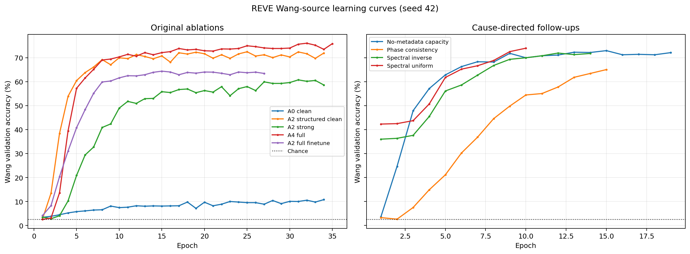
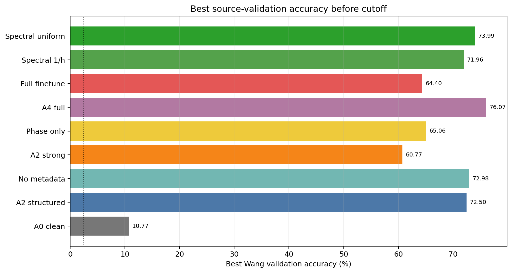
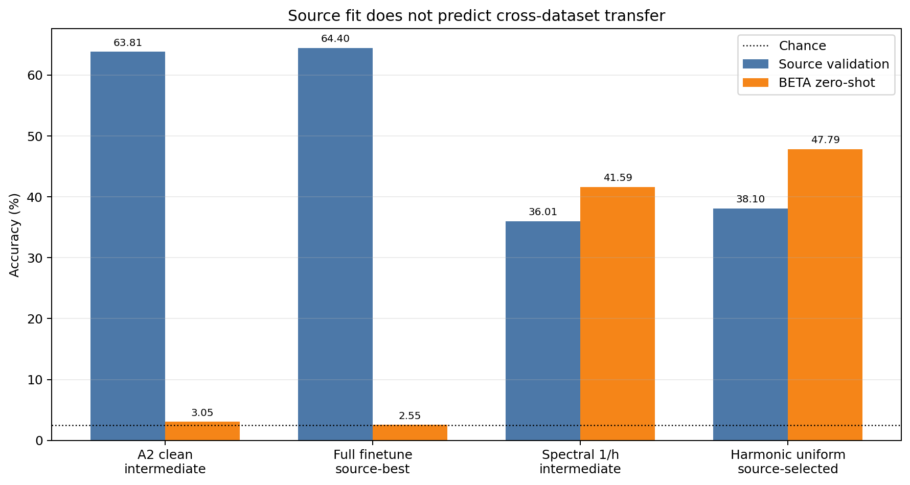
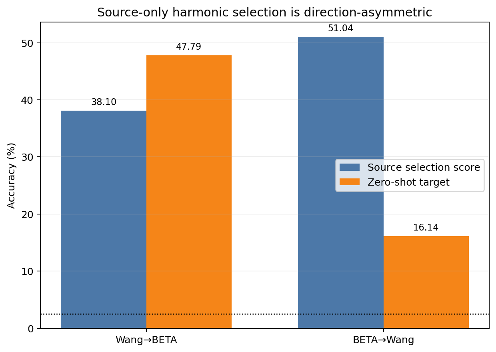

# Calibration-Free EEG overnight REVE ablation 보고서

- 작성일: 2026-09-02 (최종 A4 target 평가 2026-09-03)
- 저장소: <code>califreeEEG</code>
- 실험 project: [jm020827/calibration-free-eeg](https://wandb.ai/jm020827/calibration-free-eeg)
- 주요 방향: Wang → BETA, 보조 방향 BETA → Wang
- 공통 seed: 42
- 판정 기준: source subject-held-out validation으로 checkpoint 선택, target dataset은 zero-shot test
- 상세 CSV: [ablation_summary.csv](assets/overnight_20260902/ablation_summary.csv)

> **종합 판정:** epoch를 늘리면 Wang source validation은 최대 76.07%까지 올라가지만, spectral prior가 없는 REVE decoder의 BETA zero-shot은 2.55–3.05%로 chance 2.5%에 머물렀다. 반면 Wang validation만으로 고른 5-harmonic uniform power prior는 BETA 47.79%를 달성했다. 현재 핵심 병목은 epoch 수보다 **SSVEP frequency/harmonic inductive bias의 부재와 source-specific residual overfit**이다.

## 1. Executive summary

| 질문 | 실측 결론 | 판정 |
|---|---|---|
| epoch만 크게 늘리면 해결되는가? | A4 source 76.07%에서도 target은 2.83%, full-finetune target은 2.55% | **아니오** |
| REVE backbone을 모두 fine-tune하면 나아지는가? | train loss 0.00085, source 64.40%, target 2.55%, ECE 27.24% | **강한 source overfit** |
| metadata prompt가 효과적인가? | metadata를 모두 끈 capacity control 72.98%, structured A2 72.50% | **현재 데이터쌍에서는 지지되지 않음** |
| strong channel augmentation이 효과적인가? | A2 strong 60.77%, full-channel phase-only 65.06%, clean A2 72.50% | **clean source에는 과도함** |
| 구조적 보완이 효과적인가? | source-selected harmonic prior가 BETA 47.79%; inverse hybrid 중간 checkpoint가 41.59% | **가장 큰 효과** |
| 양방향으로 해결됐는가? | Wang→BETA 47.79%, BETA→Wang 16.14% | **방향 비대칭, 미완료** |
| 08:00 이후 GPU 작업이 남았는가? | 소유 학습 프로세스 없음 | **종료 확인** |

이전 feasibility 보고서의 제안 목표는 40-class zero-shot BA 기준 Floor 30%, Target 45%, Stretch 60%였다. 이번 Wang→BETA source-selected harmonic 결과 47.79%는 **Target을 통과**한다. 그러나 BETA→Wang 16.14%는 Floor 미달이며, 복수 seed와 최종 hybrid target 평가가 남아 있어 연구 전체 성공으로 보기는 이르다.

## 2. 기존 문서 abstract 요약과 이번 업데이트

| 문서 | 기존 abstract 수준 요약 | 이번 실측이 바꾼 점 |
|---|---|---|
| [model_training_feasibility_report.md](model_training_feasibility_report.md) | REVE+prompt+adapter+latent 아이디어는 타당하지만 AMP 경로와 실데이터 부재 때문에 조건부 준비 상태라고 평가했다. | AMP 차단을 수정하고 Wang/BETA 19,360 trial을 실제 실행했다. 준비도 분석을 넘어 source/target 수치가 생겼다. |
| [implementation checklist](../../calibration_free_eeg_codex_implementation_plan.md) | Wang↔BETA, wearable, robustness, calibration의 구현 항목과 서버 실험 미완료 항목을 구분했다. | Wang→BETA seed 42 ablation과 보조 BETA→Wang run을 수행했다. 반복 seed·wearable·최종 robustness는 여전히 남았다. |
| 기존 W&B [wang_to_beta/ennt166s](https://wandb.ai/jm020827/calibration-free-eeg/runs/ennt166s) | A4 45 epoch, best source 7.68%, BETA 2.31%, NLL 7.71, ECE 49.21%. | 새 실행에서는 source가 76.07%까지 학습됐지만 target-blind spectral evidence가 없으면 전이가 실패한다는 구조적 문제를 더 분명히 확인했다. |

## 3. 실행 환경과 데이터

| 항목 | 값 |
|---|---|
| GPU 사용 | RTX PRO 6000 Blackwell의 GPU 0, 2, 4, 6, 7에 독립 ablation 배치 |
| 보호한 작업 | GPU 1·3의 타 사용자 작업, GPU 5의 Isaac Sim을 중단하지 않음 |
| W&B login / entity | <code>jmsmlove02</code> / <code>jm020827</code> |
| HF cache | <code>/mnt/ssd3/jm020827/cache/huggingface/hub</code> |
| EEG root | <code>/mnt/ssd3/jm020827/califreeEEG/eeg_data</code> |
| 실험 root | <code>/mnt/ssd3/jm020827/califreeEEG/experiments/20260902</code> |
| Wang | 34 subjects, 8,160 trials, 40 classes; subject 35 미포함 |
| BETA | 70 subjects, 11,200 trials, 40 classes |
| REVE 입력 채널 | 64개 중 position이 없는 CB1·CB2를 제외한 62개 |
| 검증 | 40 pytest passed, diff whitespace check passed |

### Split

| 방향 | train | source validation | untouched target |
|---|---:|---:|---:|
| Wang→BETA | Wang 27명 / 6,480 | Wang 7명 / 1,680 | BETA 70명 / 11,200 |
| BETA→Wang | BETA 56명 / 8,960 | BETA 14명 / 2,240 | Wang 34명 / 8,160 |

Wang과 BETA의 structured condition 값은 reference=<code>cz</code>, hardware=<code>neuroscan_synamp2</code>, electrode=<code>gel</code>, cap=<code>wet_cap</code>, 200 Hz, 64채널, reattach missing으로 모두 동일하다. 따라서 이 데이터쌍은 dataset ID를 제외한 metadata 효과를 검증할 정보 변이가 없다.

## 4. 모델과 추가한 spectral path

~~~mermaid
flowchart LR
    X["EEG 64 × 400, 200 Hz"] --> R["REVE-base 62 mapped channels"]
    M["acquisition metadata"] --> C["condition encoder prompt + vector"]
    C --> R
    R --> P["token mean pooling"]
    P --> A["conditioned adapter"]
    A --> H["learned class logits"]

    X --> S["fixed sinusoidal references 8.0–15.8 Hz × harmonics"]
    S --> Q["phase-invariant power selected occipital channels"]
    Q --> Z["per-trial standardized spectral logits"]

    H --> SUM["logit addition"]
    Z --> SUM
    SUM --> Y["40-class prediction"]
~~~

추가한 <code>HarmonicPowerPrior</code>는 각 class frequency의 sin/cos reference에 EEG를 투영해 phase-invariant power를 계산한다. harmonic 수, channel IDs, uniform·1/h·1/h² weighting과 양의 logit scale을 config로 선택할 수 있다. REVE 경로를 대체하지 않고 learned logits에 더한다.

## 5. Ablation 정의

| Variant | 핵심 구성 | 검증하려는 가설 |
|---|---|---|
| A0 clean | REVE mean pool + MLP head | frozen representation만으로 충분한가 |
| A2 structured clean | structured prompt + conditioned adapter, single view | prompt/adapter가 source decoding을 개선하는가 |
| Capacity no-meta | 모든 metadata off, constant prompt + adapter | A2 이득이 metadata인가 추가 용량인가 |
| A2 strong | A2 + 8/4/2-channel subset, dropout, noise, shift | 강한 montage robustness가 clean 성능과 양립하는가 |
| Phase consistency | full channels, low noise, ±25-sample shift, consistency | 채널 파괴 없이 temporal invariance가 유효한가 |
| A4 full | prompt + adapter + strong consistency + latent nuisance | 전체 제안 모델의 source 상한 |
| Full finetune | A2 clean + REVE 전체 학습, LR 1e-5 | frozen backbone이 병목인가 |
| Spectral 1/h | A2 clean + occipital-8, 5 harmonics, 1/h | frequency prior가 transfer를 복원하는가 |
| Spectral uniform | A2 clean + occipital-8, 5 harmonics, uniform | Wang validation에서 고른 최적 harmonic weighting |
| B2W spectral | BETA source의 occipital-4 uniform prior | 역방향 비대칭 확인 |

## 6. Source validation 결과

| W&B run | Variant | 관측 epoch / best | best source acc | 상태 | target |
|---|---|---:|---:|---|---:|
| [gnlc3ta2](https://wandb.ai/jm020827/calibration-free-eeg/runs/gnlc3ta2) | A0 clean | 34 / 34 | 10.77% | cutoff | 미측정 |
| [xloyp77g](https://wandb.ai/jm020827/calibration-free-eeg/runs/xloyp77g) | A2 structured clean | 34 / 25 | 72.50% | cutoff | 미측정 |
| [e5av5dom](https://wandb.ai/jm020827/calibration-free-eeg/runs/e5av5dom) | Capacity no-meta, fair BS64 | 19 / 15 | 72.98% | cutoff | 미측정 |
| [xgjglfe3](https://wandb.ai/jm020827/calibration-free-eeg/runs/xgjglfe3) | A2 strong | 34 / 31 | 60.77% | cutoff | 미측정 |
| [puoczniq](https://wandb.ai/jm020827/calibration-free-eeg/runs/puoczniq) | Phase consistency | 15 / 15 | 65.06% | cutoff | 미측정 |
| [ekxce0bt](https://wandb.ai/jm020827/calibration-free-eeg/runs/ekxce0bt) | A4 full | 35 / 32 | **76.07%** | cutoff; target-only 재평가 완료 | **2.83%** |
| [i8bi2z24](https://wandb.ai/jm020827/calibration-free-eeg/runs/i8bi2z24) | Full finetune | 27 / 15 | 64.40% | finished | **2.55%** |
| [kur3tcc8](https://wandb.ai/jm020827/calibration-free-eeg/runs/kur3tcc8) | Spectral 1/h hybrid | 14 / 12 | 71.96% | cutoff | 최종 미측정 |
| [phh4lhbz](https://wandb.ai/jm020827/calibration-free-eeg/runs/phh4lhbz) | Spectral uniform hybrid | 10 / 10 | 73.99% | cutoff | 미측정 |
| [limm9vt3](https://wandb.ai/jm020827/calibration-free-eeg/runs/limm9vt3) | BETA→Wang spectral | 5 / 5 | 55.85% | cutoff | 미측정 |
| [lyrppav2](https://wandb.ai/jm020827/calibration-free-eeg/runs/lyrppav2) | Capacity no-meta, BS256 | 5 / 5 | 39.05% | 의도적 중단 | 미측정 |

<code>cutoff</code>는 best checkpoint와 validation curve는 정상 저장됐지만 약 03:43 KST에 실행 세션이 끊겨 자동 target test 전에 W&B가 crashed 상태가 됐다는 뜻이다. 이를 finished나 target 성능으로 간주하지 않는다.

핵심 source 비교는 다음과 같다.

1. A0 10.77% 대 A2 72.50%로 adapter/prompt 용량이 필수다.
2. no-metadata 72.98%가 structured A2 72.50%와 같거나 높다. 현재 Wang/BETA에서 metadata contribution은 관측되지 않는다.
3. strong 60.77%보다 full-channel phase-only 65.06%가 높다. 8/4/2-channel 강제 축소가 clean source 성능을 손상한다.
4. A4가 76.07%로 source 최고지만 BETA target은 2.83%로 chance 2.5%와 거의 같다.
5. spectral uniform hybrid가 10 epoch만에 73.99%로 source 성능도 유지했다.

## 7. Target zero-shot 근거

| 모델·선택 규칙 | source score | target | Acc / BA | Macro-F1 | NLL | ECE | ITR |
|---|---:|---|---:|---:|---:|---:|---:|
| A2 clean intermediate, source checkpoint | Wang val 63.81% | BETA | 3.05% / 3.05% | 1.78% | 4.353 | 14.33% | 0.03 |
| A4 full, source-best epoch 32 | Wang val 76.07% | BETA | **2.83% / 2.83%** | 2.05% | 4.709 | 24.84% | 0.01 |
| Full finetune, source-best epoch 15 | Wang val 64.40% | BETA | 2.55% / 2.55% | 1.01% | 4.889 | 27.24% | 0.00 |
| Spectral 1/h hybrid intermediate, source checkpoint | Wang val 36.01% | BETA | 41.59% / 41.59% | 42.29% | 2.332 | 7.27% | 37.66 |
| Harmonic uniform, Wang val에서만 설정 선택 | Wang val 38.10% | BETA | **47.79% / 47.79%** | **48.89%** | **2.135** | 8.79% | **46.92** |
| Harmonic uniform, BETA source에서만 설정 선택 | BETA source 51.04% | Wang | 16.14% / 16.14% | 15.67% | 3.326 | 12.28% | 7.56 |
| Historical A4 ennt166s | Wang val 7.68% | BETA | 2.31% / 2.31% | 2.19% | 7.707 | 49.21% | — |

중간 checkpoint target 평가는 원인 진단용이며 최종 target을 보고 checkpoint를 선택한 값이 아니다. 가장 강한 47.79% 결과는 Wang held-out validation에서 channel 수·harmonic 수·weighting을 선택한 뒤 BETA에 한 번 적용한 target-blind 결과다.

Wang→BETA에서는 target이 source selection score보다 높았지만 BETA→Wang에서는 34.91%p 하락했다. 동일 frequency label만 맞추는 것으로 양방향 domain shift가 해결되지는 않는다. BETA의 낮은 SNR·더 큰 subject 다양성에서 고른 단순 spatial aggregation이 Wang의 패턴과 맞지 않을 가능성이 있다.

## 8. 1-epoch BETA pilot 요약

Pilot은 runtime·W&B·REVE 경로 검증용이며 성능 결론에는 사용하지 않는다.

| Run | val acc | test acc | W&B |
|---|---:|---:|---|
| A0 clean | 2.77% | 2.54% | [avdag3gr](https://wandb.ai/jm020827/calibration-free-eeg/runs/avdag3gr) |
| A2 clean | 3.04% | 2.95% | [hcrnz2wa](https://wandb.ai/jm020827/calibration-free-eeg/runs/hcrnz2wa) |
| A2 strong | 3.04% | 2.99% | [ru5h6c5x](https://wandb.ai/jm020827/calibration-free-eeg/runs/ru5h6c5x) |
| A4 full | 2.72% | 3.30% | [j3cqtq5x](https://wandb.ai/jm020827/calibration-free-eeg/runs/j3cqtq5x) |
| Full finetune | 2.50% | 2.50% | [auyfx7he](https://wandb.ai/jm020827/calibration-free-eeg/runs/auyfx7he) |

## 9. 해석

### 9.1 구조 문제인가?

그렇다. 다만 REVE가 학습 불가능한 것이 아니라 **REVE pooled representation 위의 classifier가 source dataset의 phase·amplitude·subject pattern을 학습하고도 canonical frequency를 보존하지 못하는 문제**다.

- A4 source 76.07%는 optimization이 작동함을 증명한다.
- finetune train loss 약 0과 target 2.55%는 capacity 부족이 아니라 domain overfit임을 증명한다.
- phase-invariant harmonic power가 BETA 47.79%를 얻은 것은 데이터와 label alignment가 유효하고 frequency 정보가 존재함을 증명한다.
- 따라서 다음 구조는 REVE를 버리는 것이 아니라 spectral branch와 spatial/filter-bank modeling을 정식 구성요소로 승격해야 한다.

### 9.2 metadata와 latent의 기대효과

현재 Wang/BETA는 structured metadata가 완전히 같아 A2 대 no-metadata 비교로 metadata 효과를 검증할 수 없다. A4의 A2 대비 source +3.57%p도 latent·consistency·augmentation이 한꺼번에 바뀌므로 latent 단독 효과가 아니다. metadata 연구 질문은 dry/wet·impedance·hardware가 실제로 변하는 wearable 또는 OpenBCI에서 검증해야 한다.

### 9.3 augmentation

강한 channel subset은 robustness 목적에는 필요할 수 있지만 clean objective와 동시에 75% 확률로 8/4/2채널을 강제하면 학습 신호를 약화한다. 권장 방식은 다음과 같다.

- 1단계: full-channel clean + spectral branch로 frequency decoder 수렴
- 2단계: channel subset 확률을 점진적으로 증가
- clean source accuracy와 8/4/2-channel retention을 별도 endpoint로 선택
- time shift는 class-discriminative phase를 모두 지우지 않도록 주기와 frequency spacing을 고려

### 9.4 다중 GPU

이번에는 DDP 한 run보다 독립 ablation을 GPU별로 배치하는 방식이 더 유용했다. trainable parameter가 1.6–7.0M으로 작고 HDF5/CPU 공급 간격이 있어 단일 run DDP의 통신 이득이 불확실했다. 향후 DDP는 batch·worker profiling과 DistributedSampler를 구현한 뒤 긴 단일 configuration의 seed 반복에 사용하는 편이 낫다.

## 10. 코드·운영 변경

| 변경 | 효과 |
|---|---|
| preflight·validation·test·calibration에 CUDA autocast | REVE FlashAttention dtype 오류 제거 |
| calibration GradScaler | AMP 학습 경로 일관성 |
| worker-process-local HDF5 read handle cache | sample마다 파일 재open 제거 |
| persistent DataLoader workers + CUDA pin memory | epoch 간 worker 재생성 및 전송 overhead 감소 |
| optional HarmonicPowerPrior | phase-invariant SSVEP frequency/harmonic logits 추가 |
| uniform·inverse·inverse-square weighting | source-only selection 가능한 spectral ablation |
| unit/integration test | prior frequency 판별·mask·decoder 결합 검증 |

전체 test suite는 **40 passed**다.

## 11. 한계와 종료 상태

1. seed 42 한 번뿐이므로 평균·표준편차와 통계 검정이 없다.
2. Wang subject 35가 asset에 없어 34명만 사용했다.
3. 장기 run 다수가 약 03:43 KST에 execution session cutoff로 끝났다. A4는 2026-09-03에 저장된 source-best checkpoint로 target-only 평가를 완료했지만, 나머지 cutoff row 일부는 아직 target test가 없다.
4. uniform spectral hybrid 자체의 final target은 미측정이다. 47.79%는 같은 prior의 target-blind fixed harmonic 결과다.
5. BETA→Wang harmonic hyperparameter 선택은 BETA 전체 source score를 사용했다. target Wang은 선택 후 한 번 사용했지만, 다음에는 BETA subject-held-out validation만 사용해야 한다.
6. 현재 harmonic branch는 full FBCCA/TRCA가 아니라 단순 sin/cos power projection이다.
7. intermediate target 평가는 구조 가설을 세우기 위한 진단이었으며, 최종 논문 수치에는 사전 정의된 selection protocol만 포함해야 한다.
8. W&B에서 cutoff run은 crashed로 표시된다. best checkpoint와 metrics CSV는 SSD3에 보존돼 있다.
9. 모든 소유 GPU 프로세스가 종료됐고 08:00 이후 점유는 없음을 확인했다.

## 12. 다음 실행 우선순위

| 우선순위 | 실험 | 통과 기준 |
|---:|---|---|
| P0 | cutoff best checkpoint의 target-only evaluation | target을 checkpoint 선택에 사용하지 않고 모든 row 완성 |
| P0 | spectral uniform hybrid seed 7/42/123 | Wang→BETA BA 평균 ≥45%, 95% CI 보고 |
| P0 | Wang subject 35 복구 후 split 재생성 | 35명/8,400 trial asset verify |
| P1 | filter-bank harmonic branch + learnable spatial weights | fixed harmonic 47.79% 대비 target 개선 |
| P1 | BETA→Wang source-val-only spectral selection | BA ≥30% Floor 회복 |
| P1 | clean→curriculum channel augmentation | clean 손실 ≤2%p, 4ch retention ≥90% |
| P2 | wearable dry↔wet metadata/no-metadata 비교 | metadata가 실제 변할 때 A2−capacity control 측정 |
| P2 | A3 consistency와 latent 단독 분리 | 한 번에 한 요소만 바꾸는 factorial ablation |

가장 먼저 해야 할 일은 epoch를 더 늘리는 것이 아니라, 저장된 source-best checkpoint들의 target-only 평가를 완료하고 spectral uniform hybrid를 복수 seed로 재현하는 것이다.
